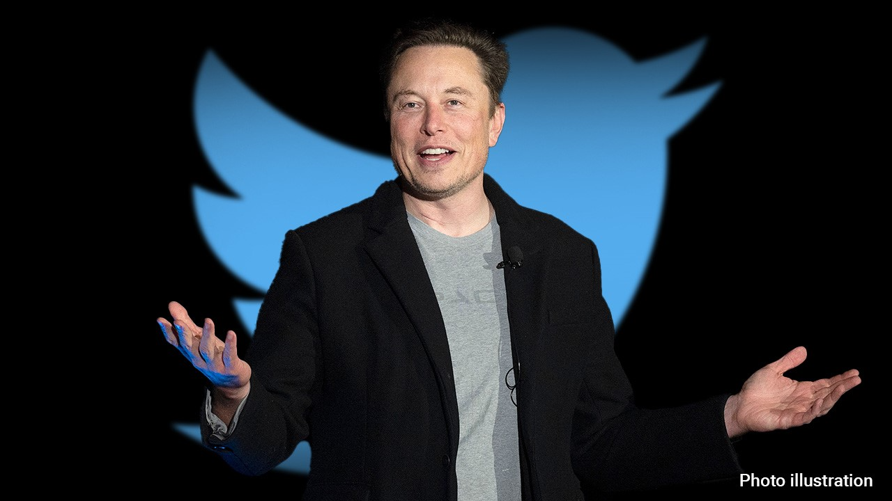

---
output:
  slidy_presentation: default
  html_document: default
  ioslides_presentation: default
  beamer_presentation: default
---

## AEB 3103 Principles of Food and Resource Economics	
### Module 1: Guiding principles of economics
  
## 
* Economics: the allocation of scarce resources
  - *"...the science which studies human behavior as a relationship between ends and scarce means which have alternative uses"* (Robbins 1932)
* Microeconomics: the study of how individuals and firms make decisions, and how these decisions interact with one another
* Macroeconomics: the study of the overall performance, structure, and decision-making of the economy as a whole
* Many sub-fields of economics: history, environmental, health, labor, econometrics, game theory, ...

## Guiding principles of economics
1. Choices are necessary because resources are scarce

(In other words, people face trade-offs)

Think about this: what resources do you have?

## And what resources does Elon Musk have?
{height=450px}

## 
And our society?

## 2. The true cost of something is its opportunity cost

* Accounting cost: the dollar amount you need to give up to get something
* **Opportunity cost**: the next best alternative you give up to get something

What is the cost of a UF men's basketball ticket?

##
{height=450px}

## And what is the cost of attending UF?
{height=450px}

## 3. People respond to incentives

* Economic incentives
  - People buy more stuff during the thanksgiving week
* Social incentives
  - Avoidance of ridicule
  - Lawns MUST be green!
* Moral incentives
  - Do the right thing
  

## And there's this:
{height=450px}

## And there's this:
{height=450px}

## And this:

* Surgical complications happen at the hospital (~5%)
  - From bacterial infection to hemorrhage
* A surgical complication:
  - Increases length of hospital stay by 14 days
  - Hospital's profit margin jumps from \$16,936 to \$55,953

**What incentive does this create?**

## 4. Decisions are made at the margin

Marginal decision-making:

* When we assess the costs and benefits of doing a little bit more or a little bit less of an activity based on the costs and benefits
  - Do I study/work for one more hour?
  - Do I farm one more acre?
  - Do I get one more piece of cookie?

We stop iff MB = MC

## 5. Trade can make everyone better off

* Market Economy: production and consumption is determined by the
decentralized decisions of individuals
* Trade: Allows people to divide tasks among themselves; each person provides a good or service other people want and in doing so they get the goods and services they want
* Specialization

## 6. Markets move towards equilibrium

* Equilibrium: when no individual has an incentive to do something different to make themselves better off
* Arbitrage: the opportunity to make one better off (incentives matter)
  - If I'm "selling" a 20-dollar bill at $15, what happens?
* Transaction costs: the cost of making a market exchange
  - market frictions

## Oil in Aruba
{height=450px}

## 
* A gallon of gasoline costs $5.3 in Aruba
  - It's an isolated island country
* Taxi drivers use tons of gasoline every day
* A gallon of gasoline costs $0.06 in Venezuela(!)

## Oil in Aruba
{height=450px}

## 7. Resources should be used efficiently to achieve societal goals

* (Pareto) Efficiency: There is no opportunity to make anyone better-off without making others worse off
* Equity: Members of the society get their FAIR share
  - Equal distribution? 
  - Equal opportunity?
  - The veil of ignorance

## K-ville again
Is this an efficient way to allocate tickets? Equitable?

{height=400px}

## 
{height=450px}

## 
{height=450px}

## 8. (Free) markets are the "best" way to (organize) economic activity
In other words, market transactions lead to efficient (but not necessarily equitable) outcomes

* Market sends the correct signal about **scarcity** to market participants
* Distorting that signal often creates perverse incentives

## Scarcity
Imagine that you manage to get into the Taylor Swift concert and had a great time. You came out of the stadium ready to go home. It is in the middle of the night, public transit has all shut down. And it is raining cats and dogs outside. 

You desperately look for a cab, as do everybody else coming out of the Stadium. You wait, and wait, and wait, for an hour. No taxi comes to pick you up. 

## 
{height=450px}

##
You open your Uber app on the phone. There is a surge pricing of 5 times here at the Stadium. You clicked the agree button, and 5 minutes later, an Uber comes to your rescue. 

##
{height=450px}

## In-class Exercise #1: Uber's Surge Pricing

1. What incentives do surging pricing create for the passengers? For the cab drivers?
2. Who is better off? And who is worse off?
3. What will happen if the city of Jacksonville passed a rule capping the maximum surge pricing to be 1.5X of normal fare?

## 9. When markets don’t achieve efficiency, government intervention can improve efficiency.

Market failure: situations when markets do not achieve efficient outcomes

Sources of market failure:

* Market power
* Property rights failures / Externality
* Information asymmetry
* (Business cycles)

(Note: this problem is covered extensively AEB 2451: Economics of Resource Use / AEB 3450: Intro to Natural Resource and Environmental Econ)

## 
* What will happen when robbing a bank is not a crime?

## Macroeconomic Principles
10. One person's spending is another person's income
11. Overall spending sometimes gets out of line with an economies' productive capacity
12. Government policies can change spending

  
  
  
  
  
  