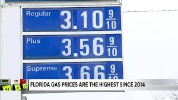
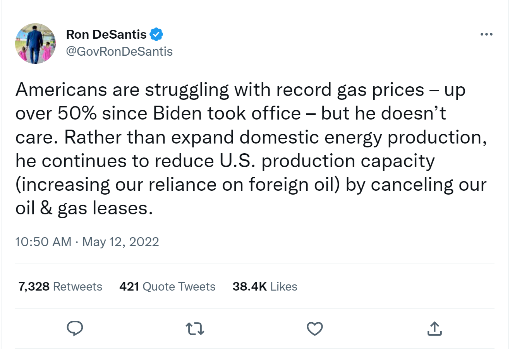
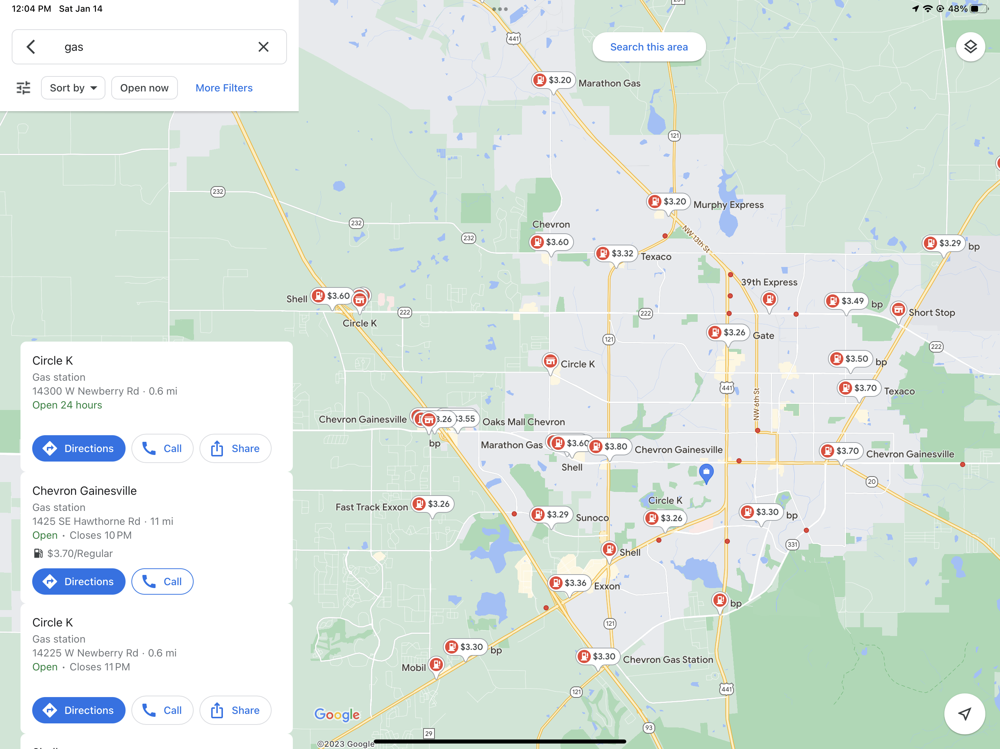
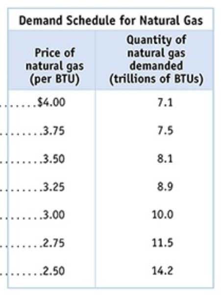
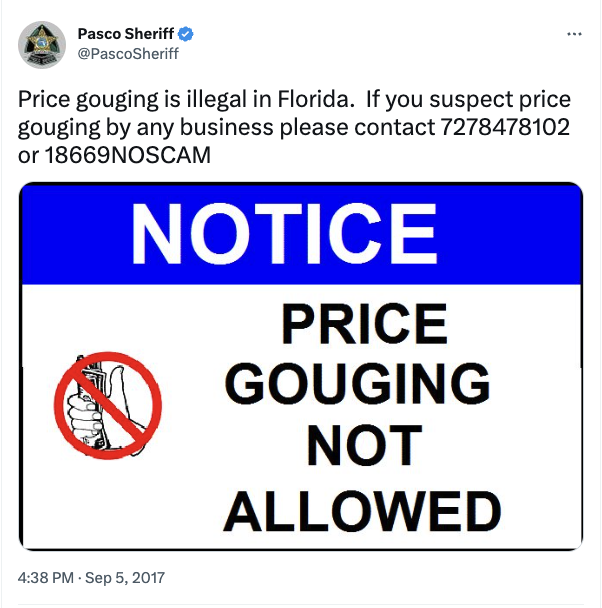
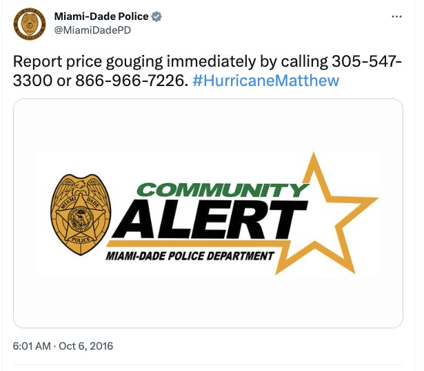
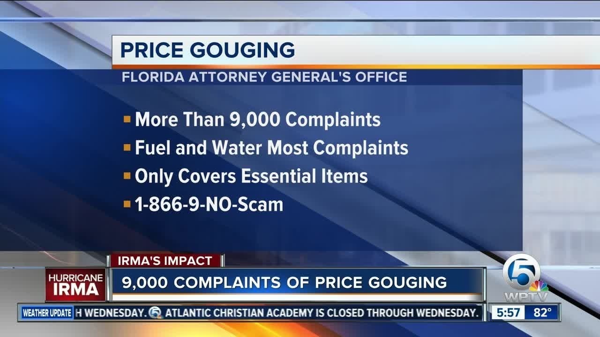
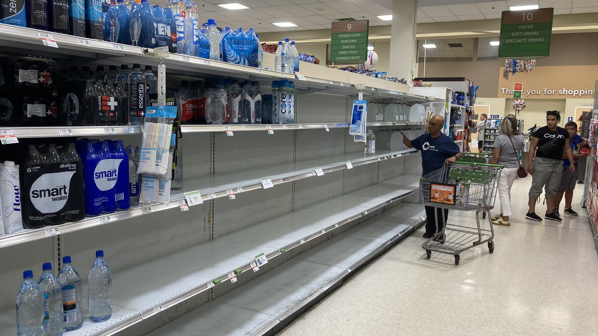
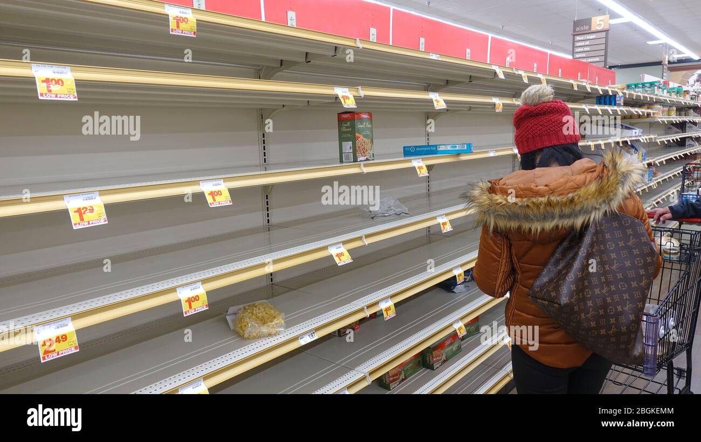
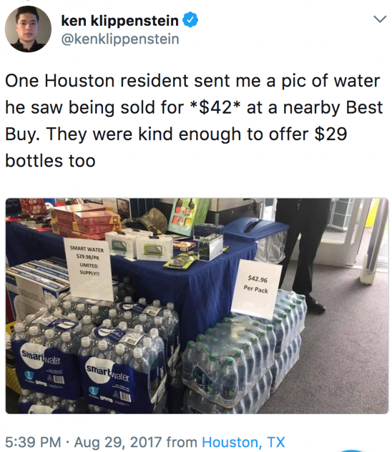

---
output:
  beamer_presentation: default
  html_document: default
  ioslides_presentation: default
  slidy_presentation: default
---
  
## AEB 3103 Principles of Food and Resource Economics	
### Module 2: Supply and Demand


##
{height=450px}

## 
Who determines gasoline price?

##
{height=450px}

##
{height=450px}

##
{height=450px}


##
{height=450px}

## Components of a market

* Buyers (consumers)
* Sellers (producers)
* Intermediary (somewhere/some place to exchange goods)

## Competitive market:

For now let's focus on **perfectly competitive market**

(Really, a talking lion)

* A perfectly competitive market never exists (just like a )
* Yet studying it can give us many interesting intuitions

## Conditions of competitive markets

1. There are lots of buyers and sellers
  - Each is "small" compared to the size of the market
2. Good and/or service are identical
3. Free entry & exit
4. Perfect information about prices & goods

## Think about the following market

* The market for corn
* The market for bitcoin
* The market for catchup

## Definition of demand

* Represents the behavior of buyers (consumers) of a good or service
* Demand: the quantities of a good that buyers are willing to purchase at a series of alternative prices in a given market, *ceteris paribus*
  - *ceteris paribus* - (Latin) holding everything else equal
* Essentially a relationship between price and quantity consumed
  
## The law of demand
What happens when the price of something goes up?
$P\uparrow -> Q_d \downarrow$
$P\downarrow -> Q_d \uparrow$

## The law of demand
```{r,echo=FALSE,fig.align='right',out.width="50%"}

```

## The law of demand
As the price of a good increase, the quantity demanded of that good decreases. 

(Demand curves are downward sloping.)

Some other concepts: 

* Slope
* Choke price
* Satiation point

## Some more math/graph about the demand curve

Suppose we have a demand curve: P = 100 - 2Q. What does that even mean?

## Shifting the demand curve

* The demand curve depicts the price-quantity relationship at a given point of time
* It can change (shift) over time
* Note: Shifting demand are NOT the same thing as moving along a demand curve.
  - Moving along the demand curve: price of a good changes.

**Let's say we have a demand curve for hotels here in Gainesville, FL. What shifts its demand?**

## Five factors that shift the demand curve:

* Change in price of related goods
* Change in income
* Change in consumer tastes and/or preferences
* Change in expectations
* Change in the number of consumers

## 1. Changes in the prices of related goods and services

* Substitutes - when two goods are (partially) interchangeable
  - Coke and Pepsi; Apple and Samsung; Apple and Orange
  - $\uparrow$ Price of substitute, $\uparrow$ demand (shifts outward)

* Complements - two goods consumed together
  - Salt and pepper; cheese and cracker; Apple and Phone Case
  - $\uparrow$ price of a complement, $\downarrow$ demand (shift inward)
  
## Example

Example: Suppose you’re a chef, and you can serve steak or chicken interchangeably in your recipes. Due to some unforeseen issues associated with the supply chain of cattle, the price of beef increases dramatically.

1. Are chicken and beef substitutes or complements? 

2. What happens to the demand curve for margarine?

3. What happens to the demand curve for beef?

## 2. Changes in income
* Individual income levels affect demand for goods and services
* Normal goods: Income $\uparrow$, Demand $\uparrow$
  - Housing, clothing, vehicles
* Inferior goods: Income $\uparrow$, Demand $\downarrow$
  - Instant noodle; disposable silverware

## 3. Change in taste and preferences

Tastes and preferences are subjective and vary across individuals

* Seasonalities: fruit; pumpkin spice; ugly sweaters
* Attributes: quality; organic; sustainablity certification, etc. 
* Style

##
{height=450px}

## 4. Change in expectations
If you expect prices to change in the future, it may affect your demand today.

Example: Should you buy a house today if you expect interest rates to rise by 3% next year?

## 5. Changes in the number of consumers

More consumers **increases** demand.

* Florida is one of the fastest growing states in the nation
* How does that affect
  - housing demand?
  - food demand?


## Aggregating market demand

Aggregate demand: horizontal sum of all individual demand curves in the market

## In-class exercise #2:

Suppose we’re interested in the market for hamburgers. What happens to demand for hamburgers in the following scenarios:

* The price of tacos increases
* The price of hamburgers increases
* All hamburger sellers raise the price of French fries 
* Income falls in town (assume hamburgers are a normal good)
* Income falls in town (assume hamburgers are an inferior good)
* Hot dogs become cheaper
* New research identifies beef as a major contributor to greenhouse gas emissions, something consumers would like to avoid. 


## Supply
Represents the behavior of sellers

The law of supply: As the price of a good increases, the quantity supplied of that good increases, *ceteris paribus*

## Graphing supply curves


## Shifting the supply curve

* The supply curve depicts the price-quantity relationship at a given point of time
* It can change (shift) over time
* Note: Shifting supply are NOT the same thing as moving along a supply curve.
  - Moving along the supply curve: price of a good changes.

**Let's say we have a supply curve for hotels here in Gainesville, FL. What shifts its supply?**

## Five factors that shift the supply curve

1. Change in input prices
2. Change in prices of related goods
3. Change in technology
4. Change in expectations
5. Change in the number of suppliers

## Changes in input prices

Decrease input price -> profit increase -> encourages more supply

Increase input price -> profit decrease -> discourages supply

Example: When chip price increases, computer and phone prices increase

## Changes in prices of related products

* Substitutes and completments exist in production too!
* Complement (production): when goods are produced together (e.g. by-products, intermediate products on the supply chain).
  - fracking produces both natural gas and oil
  - Corn grain (to produce ethanol) and silage (to produce livestock feed)
  - Optical lithography machine, chips, and smart phones
  - **Price of a complementary good increases, $Q_s$ increases**
* Substitutes (production)
  - Corn and soybean (competing for land)
  - Car and computer (competing for chips)
  - **Price of a substitute increases, $Q_s$ decreases**

## Changes in technology
**Innovation lowers costs and increases supply**

* Why are we able to avoid the Malthusian trap?

## 
{height=450px}

##
{height=450px}

## Changes in Expectations

Prices expected to increase -> Supply goes down

(Under one condition: the producer can actually stock the product without depreciation)

* Houses?
* Computers?
* Strawberries?

## Changes in the number of producers

* Market entry -> # sellers increases -> supply increases
* Market exit -> # sellers decreases -> supply decreases

## Aggregated supply curve


## Market Equilibrium

* Equilibrium: when the amount that consumers would purchase at the price exactly equals what producers would supply at that price
* At P*, $Q_s$ = $Q_d$

## Solving for market equilibrium
Suppose we have:

* market demand: $P = 10 - 2Q_d$
* market supply: $P = 0.5Q_s + 5$

What is the equilibrium price, P\*, and equilibrium quantity consumed and produced, Q\*?

## What happens when the market does not clear?

* Shortage ($Q_d$ > $Q_s$)
  - Upward pressure on price for both buyers and sellers
  - Buyers: willing to pay more & buy less
  - Sellers: willing to produce more and sell higher
* Raising prices make both buyers and sellers better off

## 
* Excess supply, also known as surplus ($Q_s$ > $Q_d$)
  - Downward pressure on price for both buyers and sellers
  - Buyers: willing to pay less
  - Sellers: willing to produce less and sell lower

## Price Gouging
After hurricane Charley:

* At a gas station in Orlando, they were selling two-dollar bags of ice for ten dollars. Lacking power for refrigerators or air-conditioning in the middle of August, many people had little choice but to pay up. 

* Downed trees heightened demand for chain saws and roof repairs. Contractors offered to clear two trees off a homeowner's roof — for $23,000. 

* A seventy-seven-year-old woman fleeing the hurricane with her elderly husband and handicapped daughter was charged \$160 per night for a motel room that normally goes for \$40.

##
{height=450px}

##
{height=450px}

##
{height=450px}


## The price gouging statue
Florida Statute 501.160 states that during a state of emergency, it is unlawful to rent, sell, lease, offer to rent, sell, or lease essential commodities, dwelling units, or self-storage facilities at an unconscionable price. A price is presumed to be unconscionable if: (1) there is a gross disparity between the price charged during the state of emergency and the average price during the 30 days before the state of emergency or (2) the price grossly exceeds the average price the same or similar commodity was available in the trade area during the 30 days before the declaration of the state of emergency, unless the seller can justify the price by showing increases in its costs or market trends. Examples of necessary commodities for storm events are food, water, ice, gas, lodging and lumber.

##
{height=450px}

##
{height=450px}

##
{height=450px}

##
**Michael Sandel**, moral philosopher at Harvard:

"This is not the normal free market situation where willing buyers freely elect to enter into the marketplace and meet willing sellers, where a price is agreed upon based on supply and demand. In an emergency, buyers under duress have no freedom. Their purchases of necessities like safe lodging are forced."

"If you look closely at the price-gouging debate, you'll notice that the arguments for and against price-gouging laws revolve around three ideas: maximizing welfare, respecting freedom, and promoting virtue..." (And none of these three ideas stand.)

**Milton Friedman**: "Gougers deserve a medal."

##
You are a resident of Fort Myers, FL. NWS says that Hurricane Ian will make landfall within the next 36 hours. You expect that the hurricane will cause your home to be cut off from water and electricity for days, and you currently do not have enough supply for water, battery, and gas stocked. 

There are two local stores in your town. **Aabadaba** has a huge line in front of the store with other folks eager to buy essential items. Your estimate is that you are not going to get those essentials when it is your turn. They are charging their regular price. **Babadaba** has water, battery, and gas available for purchase right away, but the price is 50% higher than what they normally sell these goods. 

1. Which store would you turn to?
2. How does the supply and demand curve shifts from normal in this case, and what does that imply about the equilibrium?
3. How do you think about the behavior of the two stores?

## 
You are the owner of a local store in Fort Myers, FL. NWS says that Hurricane Ian will make landfall within the next 36 hours. You have only limited inventory items for water, battery, and gas. There is a huge line in front of your store with folks urging for those essential items. 

A local wholesale company will make one last shipment to your store tomorrow, but they are charging 40% higher price than usual. Your gross margin is only 20% - so if you restock inventory and sell at the regular price, you will lose money. 

You have the following options. Which one should you choose, and why?

1. Sell inventory at normal price, and do not restock until after the hurricane
2. Restock and sell at 50% higher price than usual
3. Restock and sell at normal price, which incurs at least a 20% loss for every item you sell


## Moving into new equilibrium

What happens to the market equilibrium when supply or demand shifts?

## 
Consumers in Gainesville consider houses and apartments to be substitutes. There is an increase in the price of houses in Gainesville at the same time three new apartment buildings open there. In the market for apartments in Gainesville:

(This is one of the ambiguous problems from the textbook)

a) the equilibrium price will rise.
b) the equilibrium price will fall.
c) the equilibrium quantity will rise.
d) the equilibrium quantity will fall.


## 
What happens to the equilibrium price and quantity if following a social media campaign, more people want to play Minecraft?

## 
How does COVID impacts the equilibrium price and quantity of beef?


