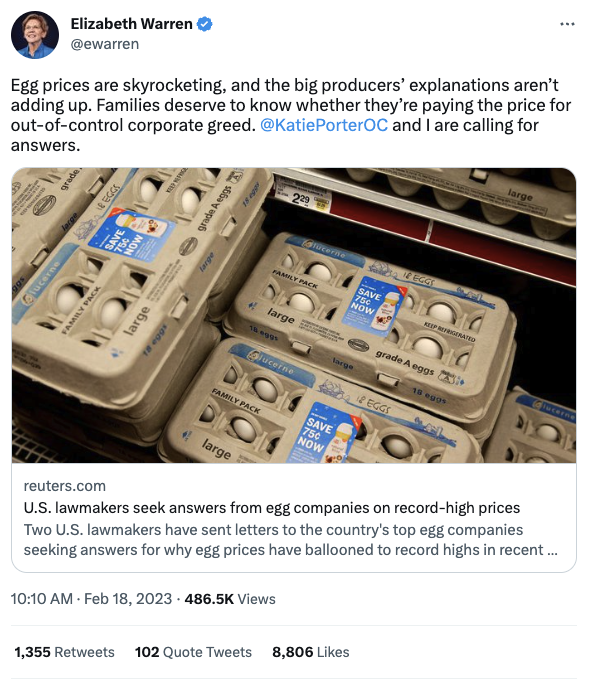

---
output:
  slidy_presentation: default
  html_document: default
  ioslides_presentation: default
  beamer_presentation: default
---
  
## AEB 3103 Principles of Food and Resource Economics	
### Module 3: Consumer and Producer Surplus

##
* Consumer’s willingness to pay: the maximum price at which he or she would buy that good.
* **Individual consumer surplus**: the gain to an individual buyer from the purchase of a good; the difference between the price paid and what the buyer is willing to pay.
  - I am willing to pay \$2 for an apple; the apple costs \$1. My consumer surplus is \$1.

##
Question:

  1. Why can't the supermarket sell at \$2 to me if I'm willing to pay \$2?
  2. If they can, then is our society worse off?

##
* **Total consumer surplus**: the sum of individual consumer surpluses of all buyers in a market.
  - Economists often use the term consumer surplus to refer to both individual and total consumer surplus.
  
## 
{height=450px}

## 
More generally, consumer surplus is the **area** between the demand curve and the price

Example: If the demand curve is P=60-12Q. How much is the consumer surplus at an equilibrium price of $30?

## Consumer surplus increases with a price decrease
For two reasons: 

1. Everyone just gets a discount
2. There are new (previously unwilling) consumers buying the product

##
* **Producer surplus**: the difference between market price and the price at which firms are willing to supply the product.
* Individual producer surplus: the net gain to an individual seller from selling a good. It is equal to the difference between the price received and the seller’s cost (the seller’s cost includes monetary costs; it may also include other opportunity cost).
* Total producer surplus: the sum of individual producer surpluses of all the sellers in a market.

## 
{height=450px}

## 
More generally, producer surplus is the **area** between the demand curve and the price

Example: If the demand curve is P=10Q-5. How much is the producer surplus at an equilibrium price of $30?

## Producer surplus decreases with a price decrease
For two reasons: 

1. Markup/profit becomes smaller
2. There are fewer (previously willing) producers supplying the good

## Total surplus
{height=450px}

## Total Surplus
* Total surplus = consumer surplus + producer surplus

## What can we say about market allocations of resources?
* Markets are usually **efficient**: there is no way to make some people better off without making other people worse off. 
* *When market is complete and competitive*, markets are usually efficient because they maximize total surplus 
* Three ways you might (unsuccessfully) try to increase the total surplus:
  1. Reallocate consumption among consumers.
  2. Reallocate sales among sellers.
  3. Change the quantity traded.
  
## WHY REALLOCATING CONSUMPTION LOWERS CONSUMER SURPLUS

Every student who buys a book at the market equilibrium has a willingness to pay of \$30 or more, and every student who doesn’t buy a book has a willingness to pay of less than \$30.

## WHY REALLOCATING SALES LOWERS PRODUCER SURPLUS
Any student who sells a book at the market equilibrium has a lower cost than any student who keeps a book.

## WHY CHANGING THE QUANTITY LOWERS TOTAL SURPLUS
Anyone who wouldn’t have bought the book has a willingness to pay of less than \$30, and anyone who wouldn’t have sold has a cost of more than \$30.

## In-class Exercise:

Suppose the supply curve for citrus is P = 1.5Q; the demand curve is P = 18 - 0.75Q

1. Calculate the market equilibrium
2. Calculate the consumer, producer, and total surplus under the market equilibrium
3. Suppose government caps the price for citrus at P=10. Calculate the total surplus under such cap. 

## Competitive markets are usually efficient:
1. They allocate consumption of the good to the potential buyers who most value it.
2. They allocate sales to the potential sellers who most value the right to sell the good (e.g., who have the lowest cost).
3. They ensure that all transactions are mutually beneficial: Every consumer who makes a purchase values the good more than every seller who makes a sale.
4. They ensure that no mutually beneficial transactions are missed: Every potential buyer who doesn’t make a purchase values the good less than every potential seller who doesn’t make a sale.

## "The invisible hand theorem"
The above conclusion is the famous "invisible hand" theorem: Spontaneous market players making self-interested decisions will collectively achieve the most efficient allocation of resources.

Adam Smith (1776): "[Man is] led by an invisible hand to promote an end which was no part of his intention...By pursuing his own interest he frequently promotes that of the society more effectually than when he really intends to promote it."

(Think about what Christianity, Islam, or Buddhism tell us about greed.)

## 
{height=450px}

## Three caveats to efficiency:

* Markets sometimes **fail** to deliver efficiency (modern economics)
* Efficient allocation does not imply **fairness** (moral philosophy)
* Even when the market equilibrium maximizes total surplus, this doesn’t mean that it results in the best outcome for every individual consumer or producer (post-colonialism)

## The "fading American Dream"?
https://www.opportunityatlas.org/

## Market failures

* Monopoly, oligopoly, and monopsony
  - Corporate greed?
* Externality and flawed property rights
  - "Each man is locked into a system that compels him to increase his herd without limit — in a world that is limited. Therein is the tragedy."
* Information asymmetry
  - Labeling; Lemon laws; Adverse selection in insurance

## 
{height=450px}

##
https://disneyworld.disney.go.com/admission/
https://disneyworld.disney.go.com/admission/tickets/

## Externality, Pigovian tax, and the Coase theorem

* Under-education
* Deforestation
* Air pollution
* Climate change

## Information Asymmetry
Claim: An insurance scheme (health, homeowner, life) cannot simultaneously achieve the following three objectives:

* Cost-effectiveness
* Affordable premium 
* Universal coverage

## The Kidney Market
https://www.youtube.com/watch?v=TJio37Fo0BQ&ab_channel=NationalAcademyofSciences

##
With a partner, discuss and be ready to share: 

What is the best way to allocate the donated kidneys? 

* Sell kidneys on a free market.
* A donated kidney would go to the person waiting the longest.
* Distribute organs based on the “net survival benefit” when a kidney is matched to the recipient expected to achieve the greatest survival time from that kidney.

##

