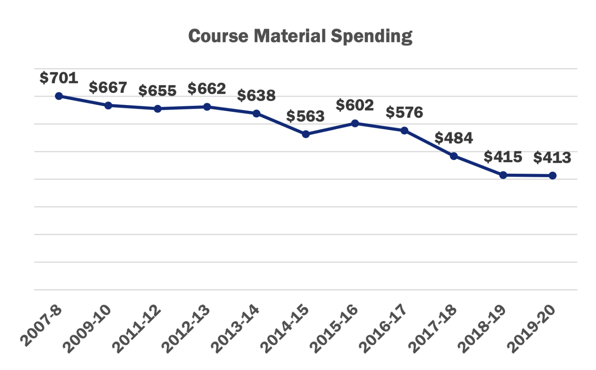
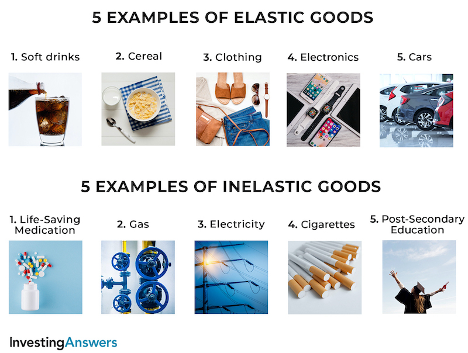
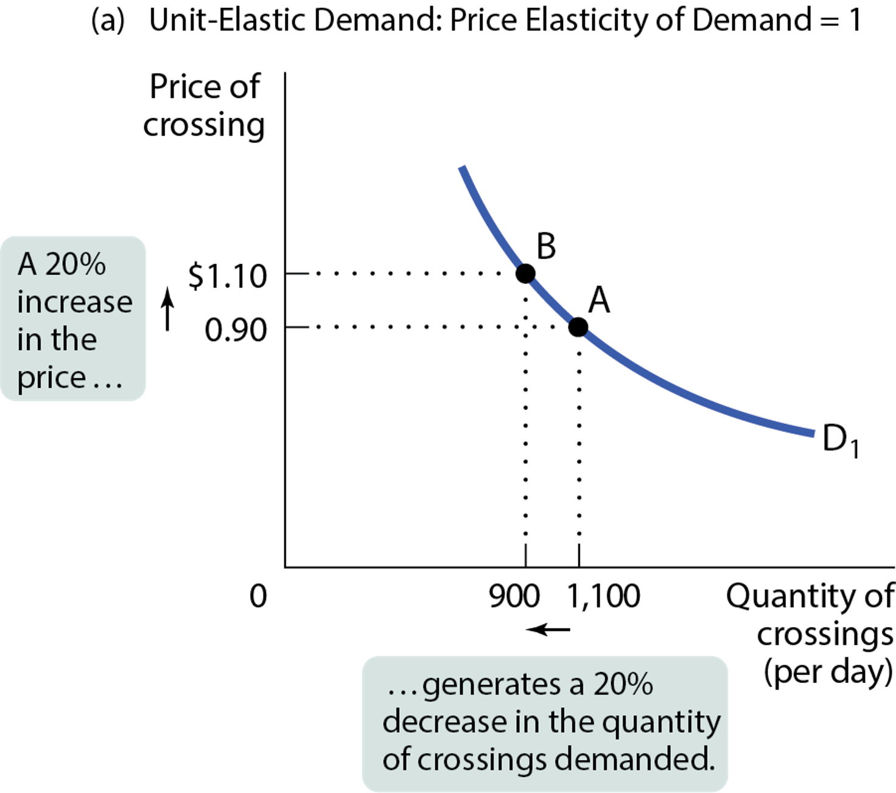
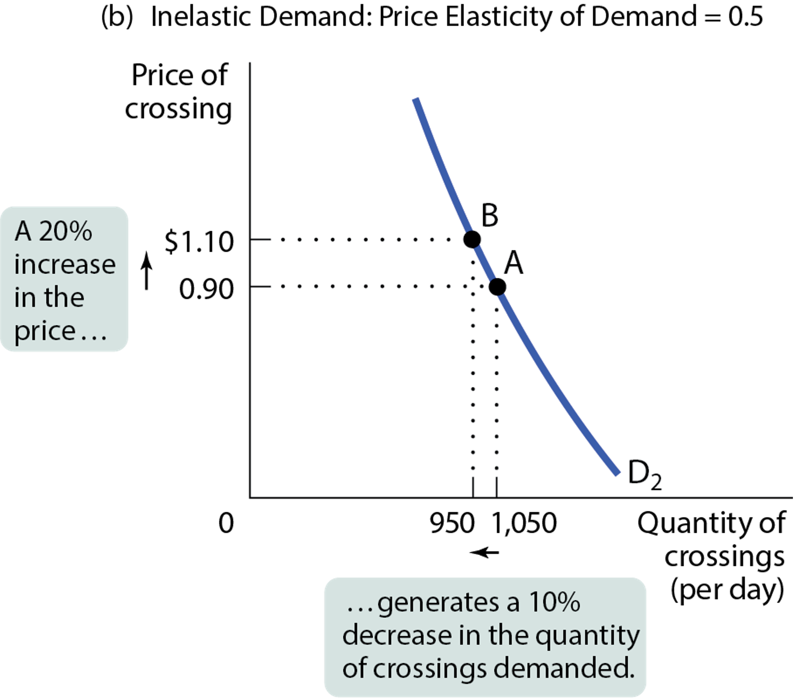
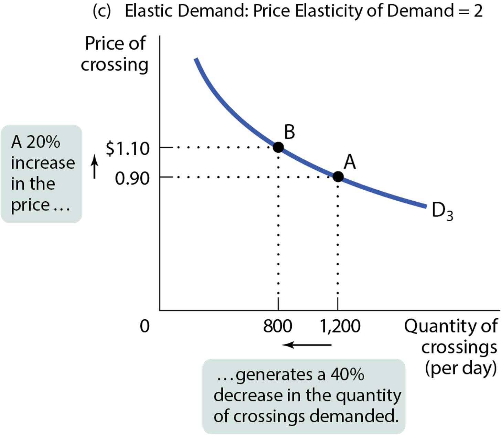
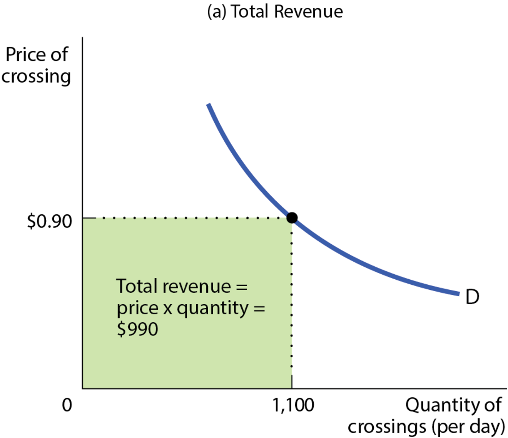
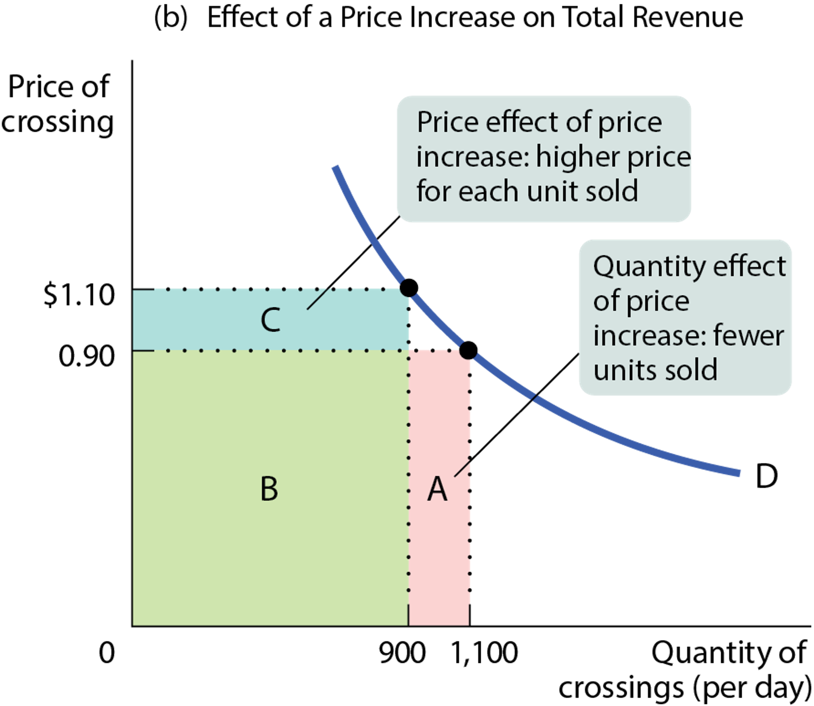
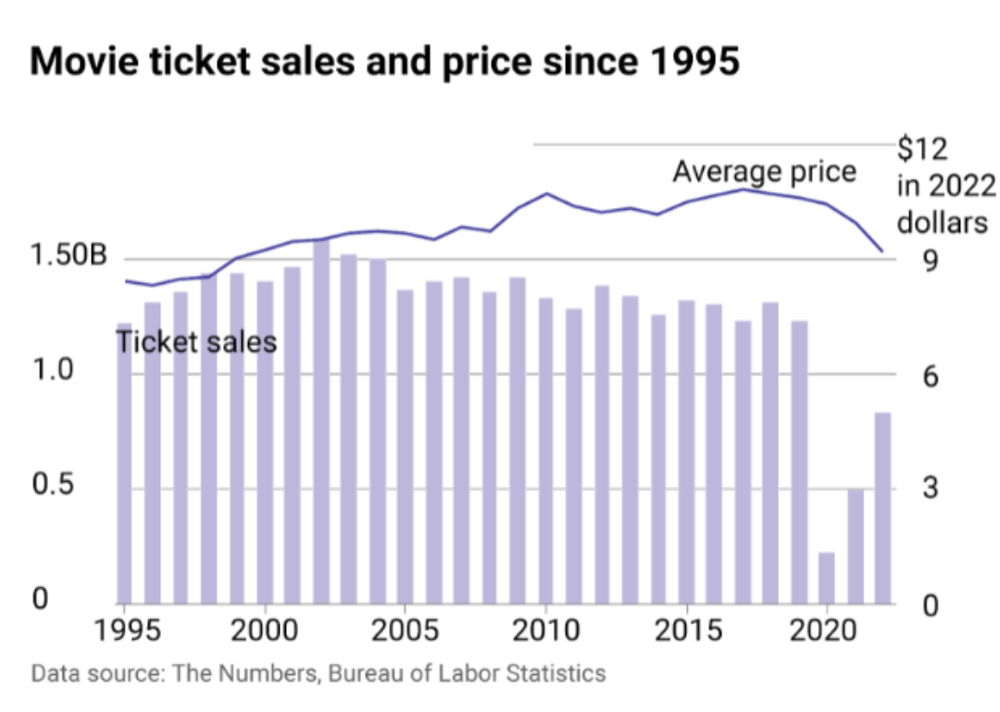

---
output:
  beamer_presentation: default
  html_document: default
  ioslides_presentation: default
  slidy_presentation: default
---
  
## AEB 3103 Principles of Food and Resource Economics	
### Module 4: Elasticity

## 
{height=450px}

##
{height=450px}

## 
Question: Why is textbook becoming more expensive, but textbook expenditure becomes lower? How could that possibly be?

##
{height=450px}

## 
{height=450px}

##
Price elasticity of demand is the measure of price responsiveness:

* A demand is elastic when an increase in price reduces the quantity demanded a lot.
* A demand is inelastic when an increase in price reduces quantity demanded just a little.

## 
{height=450px}

## Calculating price elasticity of demand

$$\text{Price Elasticity of Demand} = \frac{\text{\% change in Q}}{\text{\% change in P}}$$

Example: If the price of oil increases by 10% and the quantity demanded falls by 5%, then the price elasticity of demand for oil is: 

$$\frac{-5\%}{10\%} = -0.5$$

## The Midpoint Method
There is a problem: Our percent change calculation depends on our choice of starting point.

Example: Gasoline costs three times as much per gallon in Europe as it does in the United States. What is the percent difference between American and European gas prices? It depends on which way you measure it:

* European prices are 200% higher;
* American prices are 66.67% lower.

## The Midpoint Method
* To solve this problem, we calculate the price elasticity of demand using the midpoint formula for percentage changes.
* Instead of dividing by the initial quantity or price, we’ll use the average quantity or price.

$$\text{\% change in X} = \frac{\text{Change in X}}{\text{Average Value of X}} \times 100 $$
$$\text{Average Value of X} = \frac{\text{Starting Value of X + Final Value of X}}{2}$$

## Example
Example: At the initial price of \$10, the quantity demanded is 100. When the price rises to \$20, the quantity demanded is 90.

Find the price elasticity of demand.

$$\text{\% Change in price} = \frac{20-10}{\frac{10+20}{2}} \times 100\% = 66.6\%$$

$$\text{\% Change in quantity demanded} = \frac{90-100}{\frac{100+90}{2}} \times 100\% = -10.5\%$$

$$\text{Price elasticity of demand} = \frac{10.5\%}{66.6\%} = 0.16$$

## In-class exercise

If the price of a sushi roll drops from \$8 to \$4 and sales rise from 20 to 40 units, what is the absolute value of the price elasticity of demand using the midpoint formula?

## Classification of price elasticity of demand

A good can have a price elasticity as low as zero or as high as infinity.

* If a price elasticity < 1, the demand curve is inelastic.
* If a price elasticity > 1, the demand curve is elastic.
* If a price elasticity = 1, the demand curve is unit-elastic.

## 
{height=450px}

## 
{height=450px}

## 
{height=450px}
## Why do economists care so much about elasticity?
* Pricing strategy
  - How should companies set prices (if they have the ability to do so)?
* Taxation theory
  - How should government implement effective tax instruments?

## What factors determine price elasticity of demand:
1. Whether the good is a necessity or a luxury:
  - For necessities, quantity demanded does not change much in response to a change in P.
  - For luxuries, quantity demanded is more sensitive to a change in price.
  
What is the elasticity of:

  * Water
  * Diamond
  * icloud storage 
  * Mechanical keyboard
  
## What factors determine price elasticity of demand:
2. The availability of close substitutes:
- Fewer substitutes makes it harder for consumers to adjust Q when P changes, so demand is inelastic.
- Many substitutes make it easier for consumers to switch brands when prices change, so demand is elastic.

What is the elasticity of:
  * Bottled water
  * Gasoline

## What factors determine price elasticity of demand:
3. The share of income spent on the good:
  - It feels cheaper when we spend a smaller share of income on the good. 
  - It feels more expensive when we spend a greater share of income on the good.

* Daily commute
* Apartment

## What factors determine price elasticity of demand:
4. Time elapsed since the price change:
  - Less time to adjust means lower elasticity.
  - Over time consumers can adjust their behavior by finding substitutes (making demand more elastic).

## 
When the patent expires on a brand-name drug and five generic drugs come on the market, what happens to elasticity of demand for the original drug?

a. It rises.
b. It falls.

## Pricing Strategy

Here is (an incomplete) list of Super Bowl Commercials. What do these products have in common?

* Cars
* Food/Drink
* TV shows and movies
* Alcohol
* Gambling
* Wireless services

https://en.wikipedia.org/wiki/List_of_Super_Bowl_commercials#2023_(LVII)

## 
Here is a list of other products that never shows during Super Bowl:

* Gasoline
* Higher Education
* Utility
* Apple Inc. (last appeared in 1999)

## Elasticity and Total Revenue
Total revenue: price times quantity sold.
$$TR = P \times Q$$

When a seller raises the price of a good, there are two countervailing effects:

  * A price effect: After a price increase, each unit sells at a higher price, which tends to raise revenue.
  * A quantity effect: After a price increase, fewer units are sold, which tends to lower revenue.

##
{height=450px}

## 
{height=450px}

## 
* Inelastic demand: price increase, total revenue increase
* Elastic demand: price increase, total revenue decrease
* Unit-elastic demand: price increase, total revenue doesn't change

## Example
The elasticity of demand for eggs has been estimated to be 0.1. If egg producers raise their prices by 10%, what will happen to their total revenue?

a) It will increase.
b) It will decrease.
c) It won’t change.

## 
{height=450px}

## Other types of elasticities

* Cross-price elasticity of demand
* Income elasticity of demand
* Price elasticity of supply

(To read this: X elasticity on Y = $\frac{\text{\%change in }Q_y}{\text{\%change in }P_x}$)

## Cross-price elasticity of demand
The cross-price elasticity of demand measures how sensitive the quantity demanded of good A is to the price of good B.

Cross-price elasticity of demand = $\frac{\text{\%change in quantity demanded of A}}{\text{\%change in price of B}}$

* Example: If price of IPhone increases by 5%, how does that affect the demand of Samsung Galaxy

## Cross-price elasticity of demand
* For substitutes, cross-price elasticity of demand is positive.
  - An increase in the price of one brand of cookies will increase the demand for other brands.
  - The size of the cross-price elasticity shows how closely substitutable the two goods are.
* For complements, cross-price elasticity of demand is negative.
  - An increase in the price of milk causes a decrease in demand for Oreos.
  - The size of the cross-price elasticity shows how closely complementary the two goods are.

## Example
The price of good B increases by 4%, causing the quantity demanded of good A to decrease by 6%. The cross-price elasticity of demand is _____, and the goods are ______. 

* 1.5; substitutes
* –1.5; complements
* 0.67; complements
* –2.4; substitutes

## Income elasticity of demand
The income elasticity of demand measures how sensitive  the quantity demanded of a good is to changes in income.

Income elasticity of demand = $\frac{\text{\%change in quantity demanded}}{\text{\%change in income}}$

* Example: if the average income in Miami decreases by 10%, how does that affect the demand for beachfront houses?

## 
The income elasticity of demand can be used to distinguish normal from inferior goods.

* For normal goods, income elasticity is positive.
* For inferior goods, income elasticity is negative.

##
Tonya consumes 10 boxes of ramen noodles a year when her yearly income is \$40,000. After her income falls to \$30,000 a year, she consumes 40 boxes of ramen noodles a year. Calculate her income elasticity of demand for ramen noodles using the midpoint method. 

a. 4.2
b. –4.2
c. –2.25
d. 2.25

## Price elasticity of supply

Usually, sellers offer more when prices are higher, but how strong is that relationship?

Similar to price elasticity of demand:

$$\text{Price Elasticity of Supply} = \frac{\text{\% change in } Q_s}{\text{\% change in P}}$$
##

* Supply curve is elastic if a rise in price increases the quantity supplied a lot.
* Supply curve is inelastic if a rise in price increases the quantity supplied just a little.

## What determines supply elasticity
{height=450px}

##
1. Availability of inputs
* If an increase in production is very expensive (inputs are not easily available or cannot be shifted), then the supply will be inelastic.
* If production can be increased cheaply, then the supply  will be elastic.
2. Time
* Price elasticity of supply increases as producers have more time to respond to price changes.
* Long-run price elasticity of supply is usually higher than the short-run elasticity.

## Finally
Who really bares the burden of increasing production cost due to the bird flu?

## 
{height=450px}

