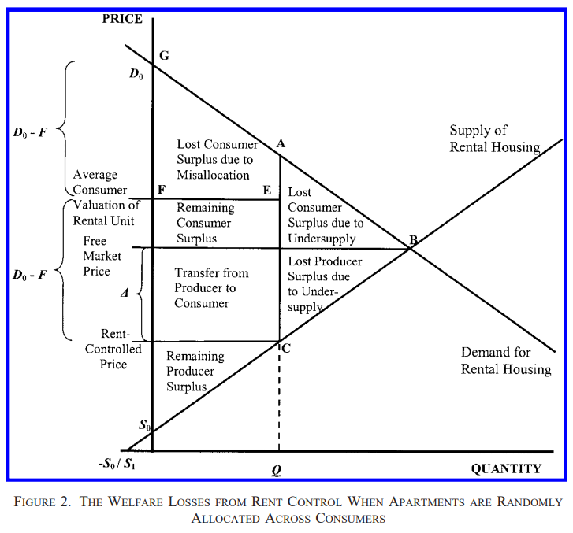

---
output:
  beamer_presentation: default
  html_document: default
  ioslides_presentation: default
  slidy_presentation: default
---
  
## AEB 3103 Principles of Food and Resource Economics	
### Module 5: Price controls, quotas, and taxes

## 
Remember the invisible hand theorem: "Spontaneous market players making self-interested decisions will collectively achieve the most efficient allocation of resources."

* Corollary 1 to the theorem: When government tries to "micro-manage" a **well-functioning market** using their visible hands, it often make things worse.

## How can government intervene market transactions?

* Price controls
  - The price of gas cannot be higher than $3/gallon
  - The price received for corn cannot be lower than $5/bushel
  - The monthly rent of thou apartment shalt not increase by more than 1.5% per year
  - Price of essential goods and services should not grossly exceed the average price within the last 30 days
  - The minimum hourly wage shall not be below $7.25
  
## 
* Quotas
  - The number of taxi medallions in New York shall not exceed 13,587
  - The area of new residential development land shall not exceed 1,000 acres next year
  
## But is it really a bad idea to control price?
Housing price index (Case-Shiller) for Gainesville FL: https://fred.stlouisfed.org/series/ATNHPIUS23540Q

Renter price index for Gainesville FL: https://www.zumper.com/rent-research/gainesville-fl

(Causal estimate of) Median income at age 35: https://www.opportunityatlas.org/

## 
* Household median income: $38,000 (2020)
* Average rent for a two-bedroom apartment: $16,800 + utilities
* What is the implied housing burden?

## How do we thinking about the current housing crisis?

* Housing affordability: does that lower the cost of housing on average?
* Housing equity: do low-income people actually get the rent-stabilized units?
* Housing quality: are the apartments actually livable? 
  - Free of cockroach, trash piling, and broken dish washers
* Moveability: how difficult is it to find housing?

How does Gainesville rank in the above three categories (with a scale of 1-10)

## Different ways of rent stablization
One quick way of fixing this problem: rent control - limiting the amount of rent that the landlord can charge the tenants. 

- If we just limit how much the landlord can charge people, that will surely solve the problem!
- 7 States have rent-control laws (with MA discussing). 37 states explicitly bans rent control laws

## Different forms of rent control
* Rent freeze: no increase in rent
* Strict control: limited rent increase passed along to new tenants
* Tenancy decontrol: limited rent increase within tenancy; new tenants can be charged at market rate

## 
"Landlords cannot be allowed to raise rents to whatever they want, whenever they want. We need national rent control."
— Bernie Sanders

"Rent control is one of many tools that local jurisdictions can use to promote access to affordable housing."
— Pete Buttigieg

"It’s time that we stop commodifying the housing market because it is not a speculative investment, it is a basic right for all Americans."
— Alexandria Ocasio-Cortez

## Discuss with your peers:

If Gainesville enacted a rent control policy starting of today, within the next 10 years what will happen to:

* Housing affordability
* Housing equity
* Housing quality
* Housing moveability

## The Economics of Rent Control
The simpler version

## 
{height=450px}

## But rent control also have other problems:

What will landlords do with the property if they are only receiving \$500/month for an apartment with a market rent of \$1200?

* If the toilet/ceiling is leaking?
* If the dishwasher is 30 years old?
* If there is cockroach everywhere?

Why isn't the landlord afraid of the tenants moving out/write bad reviews?

## Rent-stabilization makes it harder to find housing
* The waitlist for rent-stablized apartments is sometimes decades long, because:
  - No one wants to move out
* On average, renters spend more time looking for housing
  - Opportunity costs
* Under rent control, people usually get apartments through luck or personal connections.

## Can low-income households actually get those rent-stabilized apartments?
* Price controls leads to misallocation of apartments: people who badly need a place to live may not find one, but some apartments may be occupied by people with much less urgent needs. 

##
{height=450px}

## 
{height=450px}

## Rent Stablization creates black markets (and corruption)
* A black market is a market in which goods or services are bought and sold illegally—either because they are prohibited or because the equilibrium price is illegal.
* Some tenants are willing to bribe landlords.
* Black markets encourage disrespect for the law in general and worsens the position of those who are honest.
* Black markets can diminish some of the inefficiencies, but in the end, society as a whole is made worse.

## And other types of problems 
{height=450px}

## Amending rent controls: do these work?

  - Inflation-adjusted rates: rent increases with CPI + X% (7% in Oregon, 2% in Boston)
  - New unit exemption: newly-built units are usually exempt from rent control for at least 5 years
  - Luxury exemption: if monthly rent is above a certain threshold, it is off the rent stabilization list.
  - Means testing: **before** moving into a rent-stabilized unit, the government verifies if the tenant satisfies a certain income requirement

## In-class exercise:
Suppose that the demand curve for taxi rides is P = 10 - 2Q. The supply curve for taxi rides is P = 0.5Q. 

1. If the government imposes a price ceiling of $4, what is the deadweight loss in this case?
2. If the government imposes a price ceiling of $1, what is the deadweight loss in this case?

## So why price controls?
* They do benefit some people (who are typically better organized and more vocal than those who are harmed by them).
* If the price ceiling has been in effect for a long time, buyers may not have a realistic idea of what would happen without it.
* Government officials often do not understand supply and demand analysis.

## An extreme example
* Venezuela sets price controls for food, oil, housing, etc.
* When oil prices were high, President Chavez was able to subsidize price ceiling through imports
* When oil price collapse, shortage started
  - Long lines in front of stores, hunger, hyperinflation on the black market

## 
{height=450px}

##
* Maduro announced in 2014 that due to the shortage of steel, abandoned cars and other vehicles would be acquired by the government and melted to provide rebar for housing.
* In April 2014, Maduro ruled by decree that Venezuelans who owned three or more rental properties would be forced by the government to sell their rental units at a set price or they would face fines or have their property possessed by the government.
* By 2016, residents of government-provided housing, who were usually supporters of the government, began protesting due to the lack of utilities and food.

## Price Floors

Sometimes governments intervene to push market prices up instead of down.

* Price support for agricultural products
* Minimum wage

That creates a **surplus**: too much production, too little demand

## Problems with price floors
* Encouraging waste.
  - To deal with the surplus generated by dairy price floors, the U.S. government sometimes buys back the excess and donates or destroys it.
* Misallocate sales, keeps high-cost firms and discourages low-cost firms
  - Regulated US airlines business prevents low-cost airlines from entering
* Insufficiently high quality
  
## 
{height=450px}

## Graphing price floors

## Quotas

* Government dictates a fixed amount of quantity for a particular good
  - Often in the form of permits
  - Transferable quota: those permits can be bought and sold on a market place
* Example: The number of taxi medallions in New York shall not exceed 13,587

##
{height=450px}

## Let's first think about the non-transferable case
If the city of New York issues a fixed amount (that is fewer than an open-market equilibrium) of non-transferable permits:

1. What does that say about the profitability of driving a cab?
2. Who will eventually get the permit?
3. At what "price"?
4. Who will be drive the cabs?

## New York's Medallion Market

* Transferable via sale/auction
* Individual operators + medallion-holding companies
  - Lease off medallions to cab drivers for a fee
  - Medallion mortgage/finance
  
This means that medallion is an **asset** that generate economic rents

* Just like stock, housing, or any other assets

## Scarcity rent
* Price signal reflects the scarcity of the underlying asset
  - Scarcity rent is the difference between production cost and the market price
* Capping the number of permit creates economic scarcity
  - i.e. A Taylor Swift concert ticket is priced way above cost of renting the stadium, etc.
* The amount of scarcity rent reflects the underlying scarcity

##
{height=450px}

## 
{height=450px}

## What can we say about quotas from the graph

##
* Quotas create deadweight loss, decrease social welfare
* Price of the underlying asset reflects the scarcity of the regulated good
* Non-transferable quota create allocational inefficiency

