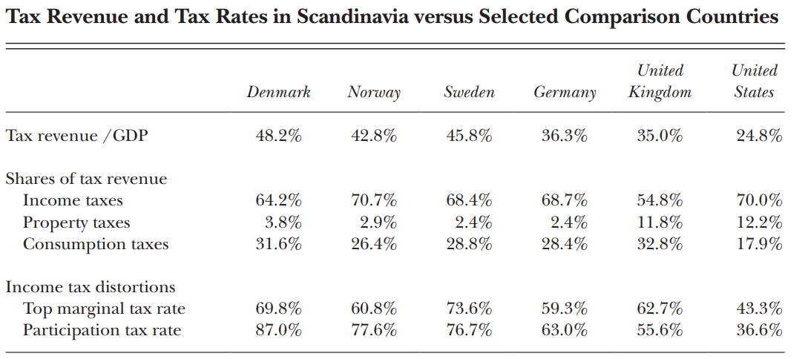

---
output:
  slidy_presentation: default
  html_document:
    keep_md: true
  ioslides_presentation: default
  beamer_presentation: default
---
  
## AEB 3103 Principles of Food and Resource Economics	
### Module 6: The Economics of Taxation

##
\textcolor{blue}{*In this world nothing can be said to be certain, except death and taxes*} - Benjamin Franklin

##
What is the first word you think about when you think about tax?

## Type of taxes

* Exercise tax: tax on goods and services
  - Everything you buy, you pay 6% tax in Florida
  - OR and NH has no exercise tax
* Income tax: tax on income
  - Different brackets; federal and state income taxes
* Corporate tax
* Capital gain tax
* Tariff

## And here's a couple of statement about taxes. Are they correct?

* Tax only affects those who actually pay taxes. 
  - For example, taxing Canadian steel = Canada will pay for that tax. 
  - Taxing food and beverage = consumers will pay for that tax
* Lower taxes stimulates consumption, which boosts the economy through multiplier effects.
* Income tax makes people less likely to work.

## 
{height=450px}

##
{height=450px}

##
{height=450px}

##
{height=450px}

## A simple model on tax
Say the government imposes a tax of $40 on each night of hotel room stay. 

* How does that affect consumption?
  - Distortion; tax neutrality
* Who is paying for the tax?
  - Tax incidence
* What are the "spillover" effects?
  - Avoidance; evasion

##
{height=450px}

## 
* The $40 excise tax is shared between buyers and sellers.
* The equilibrium price of hotel rooms falls to $60 a night.
* Hotel guests bear some of the burden as price paid by the guests (price plus tax) RISES from \$80 to \$100.
* Hotel owners also bear some of the burden as their price FALLS from \$80 to \$60.

##
{height=450px}

##
* It is not necessarily the case that consumers and producers bear equal burden of tax
  - In fact, it is rare that tax burden is equal
* In a long-distance relationship, for example, who will do more of the driving?

##
{height=450px}

##
{height=450px}

##
If demand of some good is more elastic than supply and a tax is imposed on the consumption of the good, who will bear more of the burden of the tax?

a) producers, because consumers have a greater ability to change their behavior in response to the tax
b) both parties will share the burden equally
c) consumers, because they pay the tax out of pocket
d) the government, because the tax will cause less of the good to be produced and consumed

## 
{height=450px}

##
{height=450px}

## Exercise tax creates distortion
* Deadweight loss is higher when
  - Demand is more elastic
  - Supply is more elastic
* Deadweight loss is lower when
  - Both supply and demand are inelastic
  
## 

If we have to tax consumption, which of the followings should we tax in order to minimize distortion?

* Gasoline
* Apple
* Apple Computer
* Cigarette
* Salt

##
{height=750px}

##
{height=450px}

## Two remaining questions

1. Do we actually want lower or higher tax rates?
  - THE debate between smaller or larger government
2. Given a fixed tax revenue target, which taxes should be levied?

## 1. Lower or higher taxes
Two very different paradigms:

* US: low tax rate, limited public service
* Scandinavians: high tax rate, highly-subsidized public service

## Public services in Denmark
* Free healthcare
* Free education
* Heavily subsidized childcare
* 52 combined weeks of parental leave
  - 24 weeks for each parent plus 4 weeks for mother before birth

##
{height=450px}
##
{height=450px}

## Arguments for/against higher taxes

1. Tax evasion: people find ways to evade paying taxes
  - Income tax *might* discourage labor supply
2. Tax avoidance: selective taxation creates distortion
3. Supply-side economics: cutting taxes stimulates the economy
  - But there's really no free lunch

## What should be taxed if we have to tax?
* Tax on regular items is "bad" because it creates distortion
  - If you tax one item, people 1) consumes less of it; 2) move to its substitutes
* Tax neutrality: economic decisions should be made based on economic merits, not tax reasons
  - Other than those decisions that the government wants to encourage/discourage
* Basic principle of taxation: lower tax rates and broaden tax base
  - If you tax everything at the same rate, there is no substitution effects

##
In some instances, we may want tax to achieve specific goals - in those cases, tax is designed to be non-neutral: 
* Encourage home ownership
* Encourage health insurance adoption
* Discourage carbon emission
  - Pigovian tax: correcting externality-generated distortion
* Discourage cigarette consumption

 
