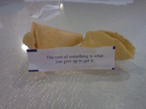
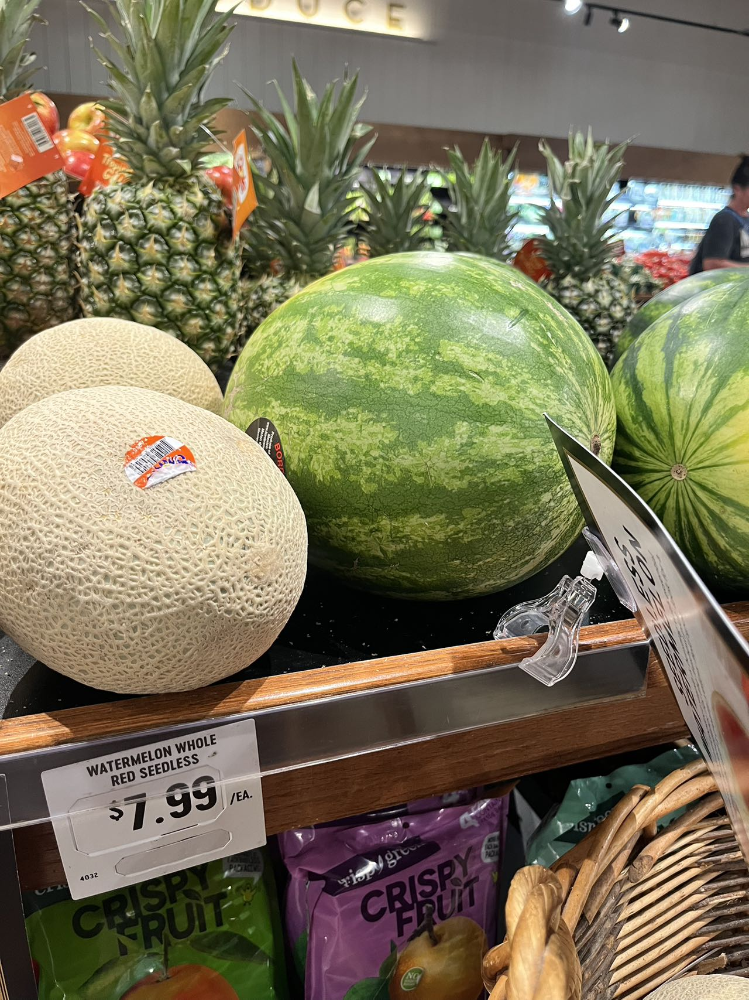
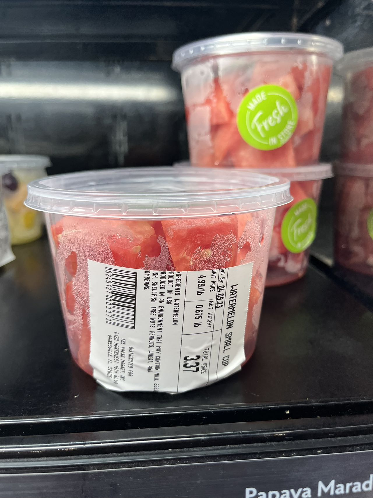
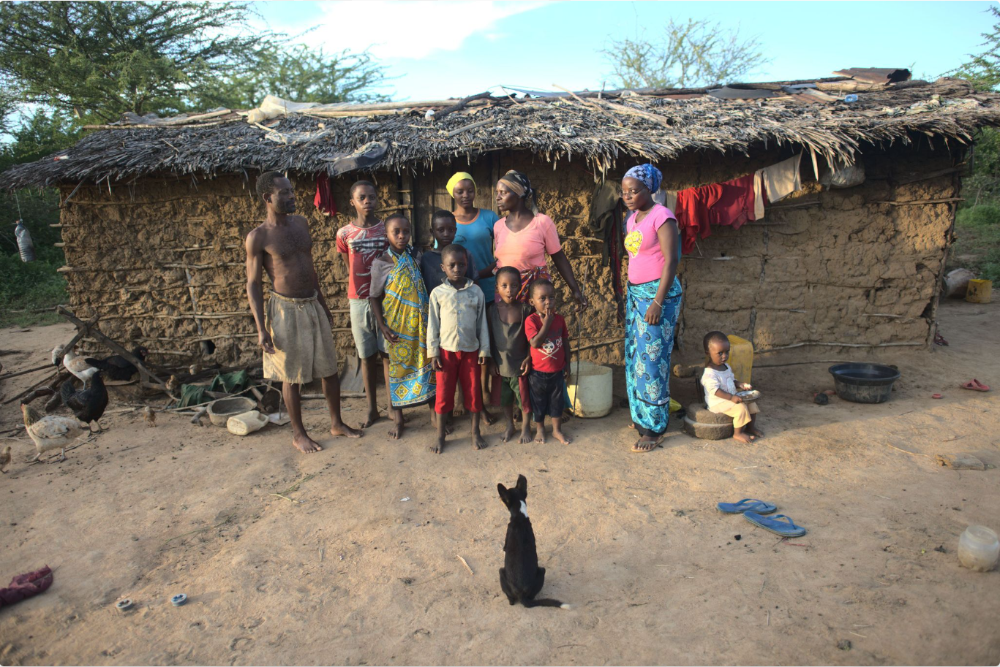
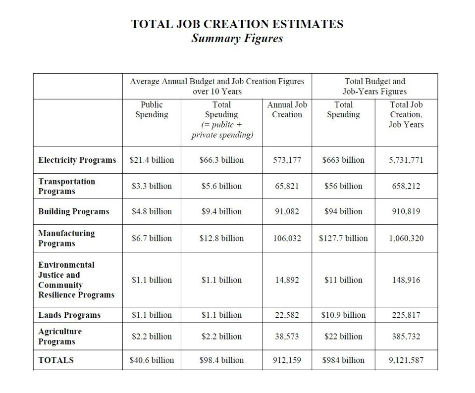
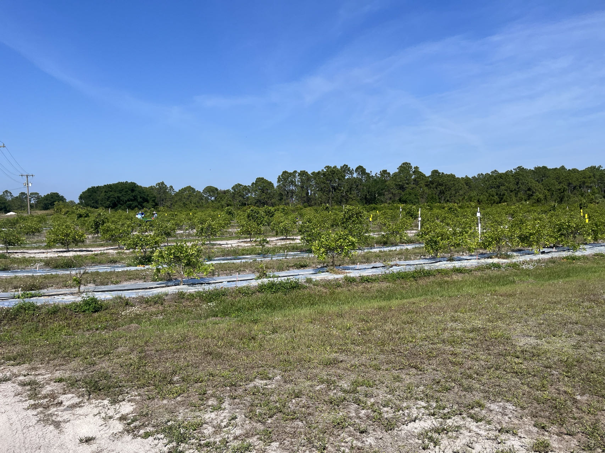
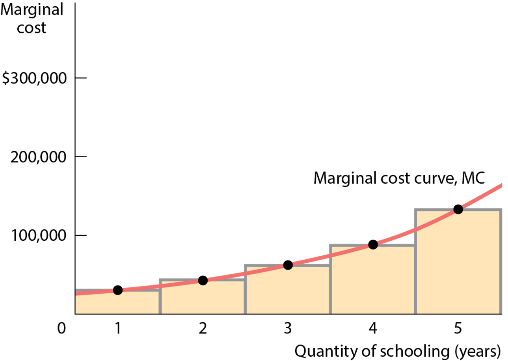
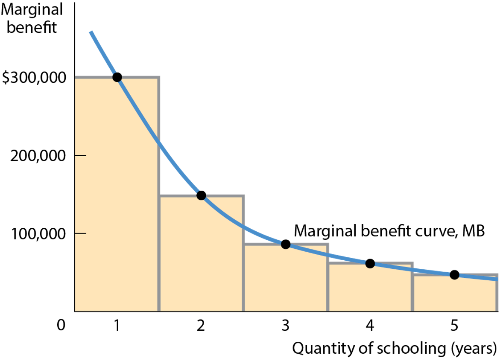
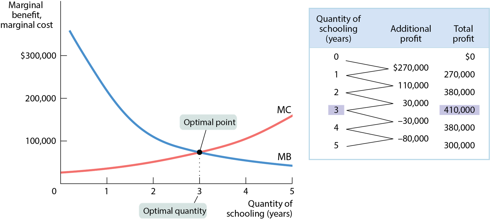

---
output:
  beamer_presentation: default
  html_document: default
  ioslides_presentation: default
  slidy_presentation: default
---
  
## AEB 3103 Principles of Food and Resource Economics	
### Module 9: Consumer theory and decision making

##
{height=450px}
## 
{height=450px}

## 
{height=450px}

## 
Why does watermelon chunk sells much more expensive than an entire watermelon?

## 
If you only have $50 to buy food for the next 14 days, what do you buy and eat?

## 
https://www.youtube.com/watch?v=uGAiihQZxpI&ab_channel=Refinery29

## Decision rule
Humans make decisions depend on comparing costs with benefits: if benefits > cost, do it. Otherwise, don't do it. 

But what are the "costs" of choosing something?

Recall opportunity cost: **Because resources are scarce, the true cost of anything is what you must give up to get it.**

## Explicit vs. implicit cost
* An explicit cost is a cost that requires an outlay of money
* An implicit cost does not require an outlay of money; it is measured by the value, in dollar terms, of benefits that are forgone
* **Opportunity cost** = Total explicit cost + Total implicit cost

## Accounting vs. Economic profits
* Accounting profit = revenue – explicit cost
* Economic profit = revenue – opportunity cost 
= revenue – (explicit cost + implicit cost)

## Phil and Claire Dunphy (USA)
{height=450px}

##
In The Price of Motherhood, Ann Crittenden claims the total cost for a **college-educated couple** to have a child is $1 million. She discusses the following items as costs of an educated woman having a child. Are these costs explicit, implicit, or neither?

-  Unearned Social Security credits
-  Forgone promotions
-  Salary lost by not working
-  Expenses for baby’s room
-  Loss of experience at work
-  Depreciation of work skills
-  Food and clothing for the child
-  Loss of pension and 401k benefits

## 
-  Awards and kudos for excellence doing a paid job
-  Babysitting fees
-  Preschool expenses
-  Earnings from paid work contributed by an employer to a retirement account
-  Doctor visits & medical expenses
-  Costs of decorating child’s room
-  Lost training opportunities at work

## How about a Columbian mother who drop out of high school and work as manual labor?

{height=400px}

https://www.gapminder.org/dollar-street/families/arrieta-diaz?countries=co

## How about a Kenyan mother who drop out of third grade and work as a subsistence farmer?

{height=450px}
https://www.gapminder.org/dollar-street/families/baya?countries=ke

##
Fertility rate in 

* US: 1.64 birth per woman
* Columbia: 1.74 birth per woman
* Kenya: 3.4 birth per woman

## The implicit cost of capital
* Capital is the total value of assets owned by an individual or firm—physical assets plus financial assets.
* The implicit cost of capital is the opportunity cost of the use of one’s own capital; that is, the income earned if the capital had been employed in its next best alternative use (e.g., forgone interest income).

##
The inflation reduction act will invest $370 billion in the next 10 years.

{height=450px}

##
{height=450px}

##
* HLB (citrus greening) has plagued 95% of Florida's citrus trees
* No known cure (IFAS is working on it). Causes decrease in yield and sweetness
* "Old citrus trees never die; they just fade away"

## 
* In the meantime, citrus growers receive constant offers from real estate developers (why?) and solar farm operators
* What is the opportunity cost of keep a five-generation citrus farm?

## "HOW much" vs. "Either-or" Decisions
There are two different types of decisions:
* A choice between two alternatives ("either–or")
* A more complex choice that requires us to choose at the margin ("how much")
  - "Should I go to college?
  - Should I take an extra year in school?"
  
## Principle of "either–or" decision making
* When faced with an "either–or" choice between two activities (all else equal), choose the one with the positive economic profit.
  - I have citrus farm of 1,000 acres of with an annual profit of \$400 per acre. The developer is offering me \$20,000,000 per acre to buy my farm. 

##
* "How much" is a decision at the margin.
  - Marginal analysis: comparing the benefit of doing a little bit more of something with the cost of doing little bit more of something—comparing marginal benefit with marginal cost.
  - Marginal cost of producing a good or service is the additional cost incurred by producing one more unit of that good or service.
  - Marginal benefit of consuming a good or service is the addition benefit generated by consuming one more unit of that good or service

##
The marginal cost curve shows how the cost of producing one more unit depends on the quantity that has already been produced.
* Each product has a unique marginal cost.  Some basic shapes:
Increasing marginal cost: Each additional unit costs more to produce than the previous one (for example, because of paying costly overtime wages).
* Constant marginal cost:  Each additional unit costs the same to produce as the previous one (in plant nurseries, for example, the cost of growing one more plant is the same regardless of how many plants have been produced).
* Decreasing marginal cost: Each additional unit costs less to produce than the previous one (often due to learning effects in production when workers gain skills and experience).

## 
{height=450px}

## Total Cost versus Marginal Cost 
It can be easy to conclude that marginal cost and total cost must always move in the same direction.

But if the marginal cost of producing the first widget is \$5, the second \$4, and the third \$3, total cost rises as marginal cost falls.

## Marginal Benefit
* Marginal benefit: the additional benefit derived from producing one more unit of a good or service
* There is decreasing marginal benefit from an activity when each additional unit of the activity yields less benefit than the previous unit.
* The marginal benefit curve shows how the benefit from producing one more unit depends on the quantity that has already been produced.

## 
{height=450px}

## 
{height=450px}

