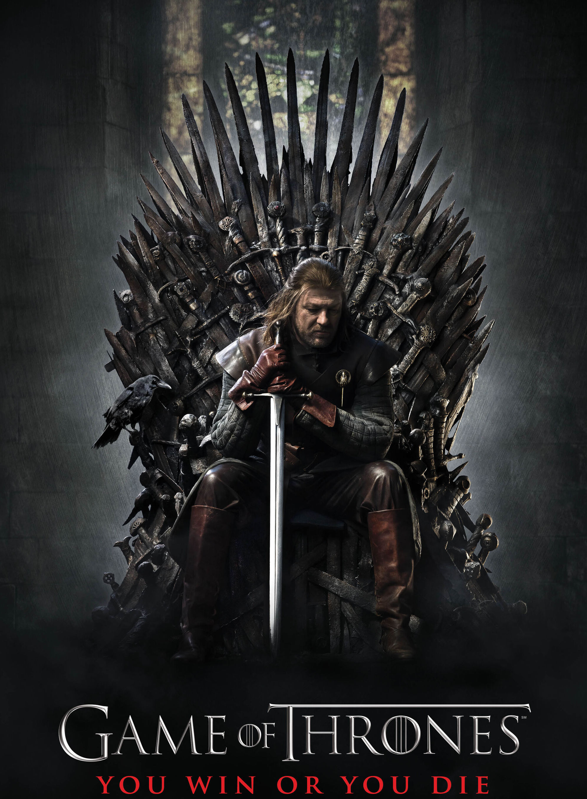

---
output:
  slidy_presentation: default
  html_document: default
  ioslides_presentation: default
  beamer_presentation: default
---

## AEB 3103, Principles of Economics
### Module 0: Kickstarter
  

## 
Xinde "James" Ji    

Assistant Professor, Natural Resource and Environmental Economics

Food and Resource Economics Department, Institute of Food and Agricultural Sciences

xji1@ufl.edu

Office hours: Tuesday/Thursday 2-3:30 pm 

Location: Physically at my office (1181 McCarty A), and virtually at https://ufl.zoom.us/j/97284739634

## 
In order to better know you guys, please fill out the following survey. I will share my answers with you in a bit :)

Link is here: https://forms.gle/ibpyJ1dGacdDGaBt9

{height=200px}

## Here we go

* James Ji

* I go by James 

* I am from Shanghai, China. I speak Chinese and English, and I'm learning Spanish.

##
{height=450px}

## Favorite book / TV show / movie

{height=450px}

## Spiritual Animal
Here's what I think I am:

{height=450px}

## 
Here's what my wife thinks I am:

{height=450px}

## Plans after UF

That's like, 35 years ahead of me

## Last Economics Course

I teach AEB 3103 (this class); Undergraduate Environmental Economics (AEB 3450); and PhD Environmental Economics (AEB 6933)

## What is economics?

Here I have a list of questions, and I want you to think about: do you think this is economics?

* What causes the business cycle (bubble and recession)?
* How human heart works?
* How fast do people drive on the I-75 highway?

## Are these economics?
* How much should bitcoin be worth?
* What causes an earthquake?
* How much do people eat at a buffet?

## Are these economics?
* Why are some countries rich and others poor?
* Should we ban off-shoring drilling?
* How many children should a family have?

## Are these economics?
* Who profits when gas price at the pump goes up? 
* Sentencing every drug dealer to life without parole can end the opioid crisis.
* Should the Gators play a 4th down and 3 at the 50 yard line?

## What does economics study?
* Economics studies how humans make decisions **under various incentives and constraints**
  - How much to each at a buffet?
  - How do you decide how fast to drive on the I-75?

## How fast to drive on the I-75?

* Fuel costs (driving faster costs more fuel)
* The (opportunity) cost of time
* The (small) possibility of getting busted by the police if you speed
  - And all the trouble after that
* The (even smaller) possibility of a car crash
  - Driving faster = More deadly crash
  
## How much to each at a buffet? 

* The cost of getting into the buffet
* The enjoyment one gets from consuming food

## What does economics study?
* Economics studies how humans make decisions **under various incentives and constraints**
* How these human decisions shape markets and societal outcomes
  - Who profits when gas price at the pump goes up?
  
## Who profits when gas price at the pump goes up?
{height=450px}

## What does economics study?
* How humans make decisions **under various incentives and constraints**
* How these human decisions shape markets and the society collectively
* What are the effects of markets and/or governmental policies
  - Can sentencing every drug dealer to life without parole end the opioid crisis?
  
## Can sentencing every drug dealer to life without parole end the opioid crisis?

* For the drug dealers, they trade-off the reward (profits from dealing) with 1) the risk of getting caught; and 2) the penalty if getting caught
* Increasing sentencing makes drug dealing more risky
* They will ask higher risk-premium (i.e., rewards)
* "Market" prices for drugs become higher
* Does a higher drug price lower drug consumption?

## What does economics study?
* How humans make decisions **under various incentives and constraints**
* How these human decisions shape markets and the society collectively
* What are the effects of markets and/or governmental policies
* How does "the economy" work
  - What cause booms and busts?
  

